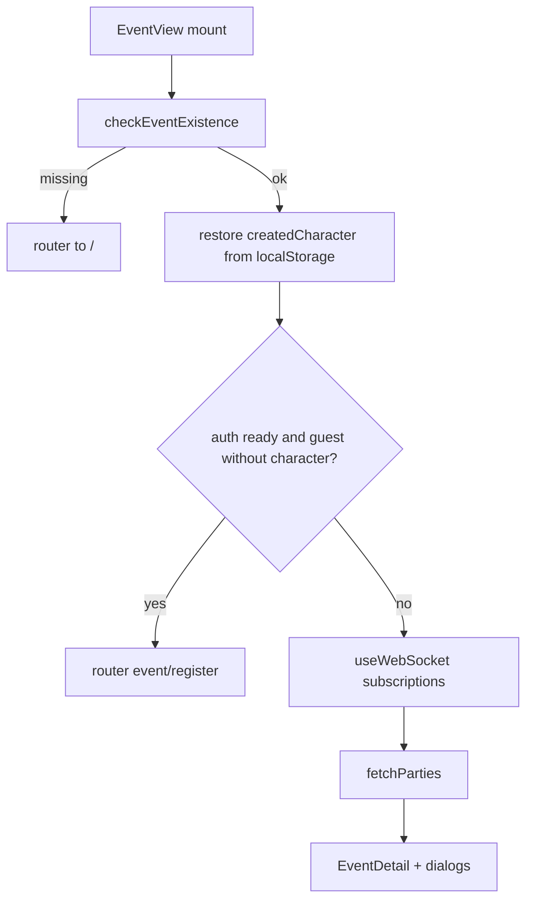

# Architecture — event page (`EventView`)

[`app/components/EventView/EventView.tsx`](app/components/EventView/EventView.tsx) orchestrates `/event?code=…`: event verification, character list, parties, WebSocket, and re-register modal.

## Main hooks

| Hook | Role |
|------|------|
| `useAuthCheck` | JWT session / signed-in state. |
| `useFetchCharacters` | GET event characters; exposes `charactersFetchErrorCode` (`CHARACTERS_FETCH_FAILED`) with no translated string. |
| `useEventData` | Ensures the event exists, loads metadata, party visibility. |
| `usePartyManagement` | Parties, shuffle, clear, API persistence. |
| `useCharacterManagement` | Participant character CRUD (created character / localStorage). |
| `useWebSocket` | Refreshes characters, parties, and event detail when the server notifies. |

## Flow (simplified)

1. **Verify** — `checkEventExistence`; if the event does not exist → redirect home.
2. **Anonymous participant** — no `createdCharacter` in local storage and user not signed in → `/event/register?code=…`.
3. **Data** — `useFetchCharacters` and `fetchParties`; WebSocket triggers refreshes.
4. **Re-register** — local character no longer in the list (e.g. admin cleared roster) → `ReRegisterEventDialog` (logic in a dedicated `useEffect`).

## Displayed errors

Character load failures use `CHARACTERS_FETCH_FAILED`; visible copy goes through [`resolveEventViewErrorMessage`](app/lib/event/eventViewErrors.ts) and i18n keys `eventPage.fetchCharactersError` / `eventPage.loadError`.

## App directory layout (high level)

- **`(marketing)`** — home `/` and portal shell (`HomePageClient`).
- **`(auth)`** — `/login`, `/register`, `/forgot-password` (server `page.tsx` + `*PageClient`).
- **`(legal)`** — `/terms`, `/privacy`.
- **`event/create`** — colocated `CreateEventPage.tsx` with the route.
- **`event/register`** — colocated `EventRegisterForm/` (also imported by `ReRegisterEventDialog`).
- **`dashboard`** — colocated `Dashboard.tsx` with the route.
- **`lib/event/`** — event-domain helpers (e.g. error codes for `EventView`), distinct from generic `lib/utils.ts` / `utils/`.

## Related files

- [`EventDetail.tsx`](app/components/EventView/EventDetail.tsx) — admin / player UI.
- [`eventPartyModel.ts`](app/components/EventView/eventPartyModel.ts) — party data model.
- [`app/services/api.ts`](app/services/api.ts) — shared HTTP calls.
